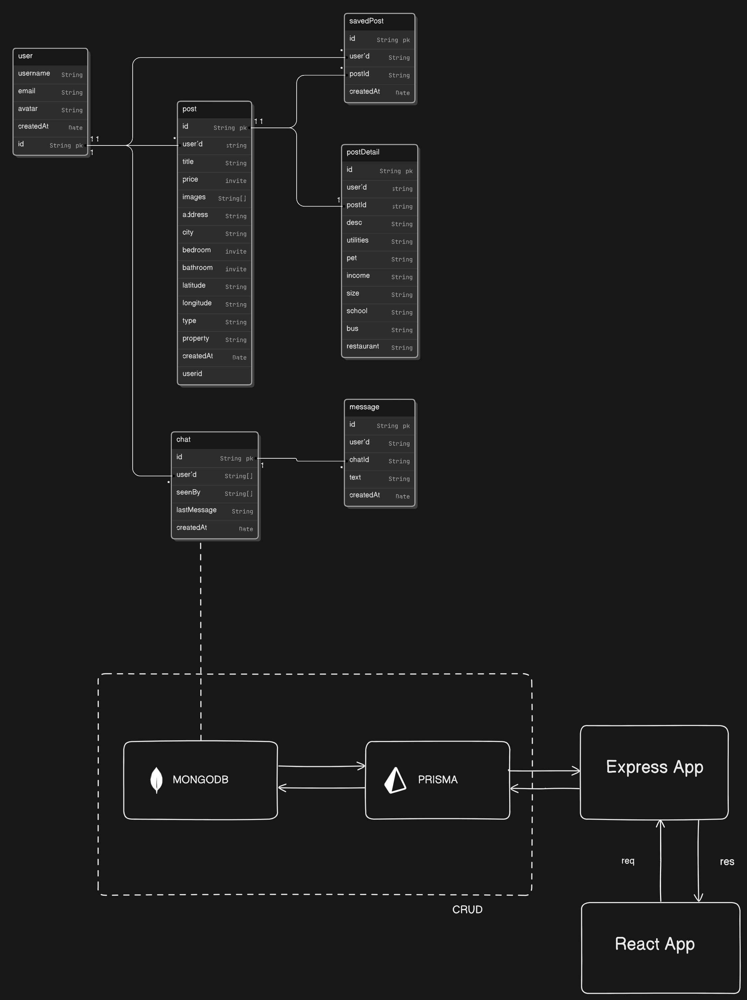
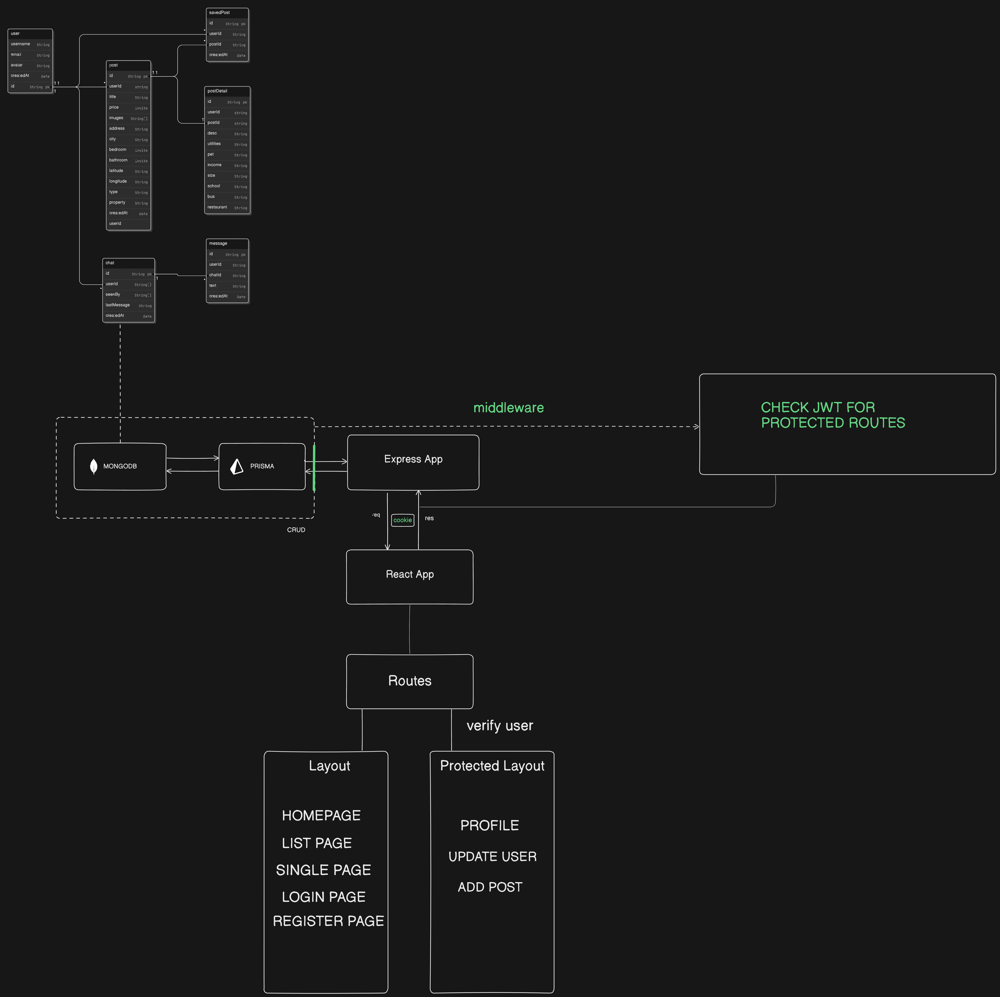

**Full Stack Real Estate App using MERN Stack, Prisma, and Socket.io**

A full-featured Real Estate web application built using the MERN stack, integrated with Prisma for database management, JWT and Cookies for secure user authentication, and real-time chat functionality with Socket.io. This project covers a wide range of modern web development techniques and ensures a responsive, interactive user experience.

### **Key Features:**
- **Frontend:** Developed using React.js, styled for responsiveness across devices using CSS, with state management via Context API.
- **Backend:** Powered by Node.js and Express.js, utilizing Prisma ORM for database interactions with MongoDB.
- **User Authentication:** Secure user login and registration system using JWT and Cookies for authentication and session management.
- **Real-Time Chat:** Integrated Socket.io for real-time messaging between users (e.g., between buyers and sellers).
- **Routing:** Client-side routing using React Router DOM, including protected routes for authenticated users only.
- **CRUD Operations:** Full Create, Read, Update, Delete (CRUD) functionality for property listings.
- **File Upload:** Image upload functionality for property listings to enhance the user experience.

### **Technologies Used:**
- **Frontend:** React.js, CSS, Context API, Zustand, React Router DOM
- **Backend:** Node.js, Express.js, Prisma ORM, MongoDB
- **Real-Time Communication:** Socket.io for live messaging
- **Authentication:** JWT, Cookies
- **Other Libraries:** React Leaflet for interactive maps, useRef for auto-scroll in chat, Zustand for state management

This project provides a robust and scalable platform for managing real estate listings, enabling users to view, search, and communicate about properties in real-time.



<!-- ------------------------------------ -->



.png>)
.png>)
.png>)
.png>)
.png>)
.png>)
.png>)
.png>)

# RealState Thunder Client Collection

## Overview

This repository contains a **Thunder Client Collection** for the **RealState** project, which includes various API requests related to authentication, user management, and post handling. The collection is designed to facilitate testing and interaction with the backend of the RealState system, which is built around user authentication, data management, and secure access to protected routes.


## API Requests

### Authentication APIs

1. **Register User** (`POST`)
   - **URL**: `http://localhost:8000/api/auth/register`
   - **Description**: Registers a new user.
   - **Body**:
     ```json
     {
       "username": "wolf",
       "email": "wolf@wolf.com",
       "password": "wolf"
     }
     ```

2. **Login** (`POST`)
   - **URL**: `http://localhost:8000/api/auth/login`
   - **Description**: Logs in a user.
   - **Body**:
     ```json
     {
       "username": "wolf",
       "password": "wolf"
     }
     ```

3. **Logout** (`POST`)
   - **URL**: `http://localhost:8000/api/auth/logout`
   - **Description**: Logs out the user.
   - **Headers**:
     - Cookie: `<JWT_TOKEN>`

### User APIs

4. **Get All Users** (`GET`)
   - **URL**: `http://localhost:8000/api/users/`
   - **Description**: Retrieves a list of all users.

5. **Get Single User** (`GET`)
   - **URL**: `http://localhost:8000/api/users/:userId`
   - **Description**: Retrieves details for a single user.
   - Example: `http://localhost:8000/api/users/66c32a7094cc344f2351361d`

6. **Update User** (`PUT`)
   - **URL**: `http://localhost:8000/api/users/:userId`
   - **Description**: Updates a user's details.
   - **Body**:
     ```json
     {
       "username": "mogambo",
       "email": "mogambo@wolf.com",
       "password": "mogambo"
     }
     ```

7. **Delete User** (`GET`)
   - **URL**: `http://localhost:8000/api/users/:userId`
   - **Description**: Deletes a user from the database.

### Protected Routes

8. **Test Protected Route** (`GET`)
   - **URL**: `http://localhost:8000/api/test/should-be-logged-in`
   - **Description**: Tests access to a route requiring user authentication.
   - **Headers**:
     - Cookie: `<JWT_TOKEN>`

9. **Test Admin Route** (`GET`)
   - **URL**: `http://localhost:8000/api/test/should-be-Admin`
   - **Description**: Tests access to a route restricted to admins.
   - **Headers**:
     - Cookie: `<JWT_TOKEN>`

### Post APIs

10. **Get All Posts** (`GET`)
    - **URL**: `http://localhost:8000/api/posts`
    - **Description**: Retrieves a list of all posts.

11. **Get Single Post** (`GET`)
    - **URL**: `http://localhost:8000/api/post/:postId`
    - **Description**: Retrieves details of a single post.
    - Example: `http://localhost:8000/api/post/66f54be0ad86a5b568401617`

12. **Update Post** (`PUT`)
    - **URL**: `http://localhost:8000/api/post/:postId`
    - **Description**: Updates the details of an existing post.

## How to Use

1. **Import Collection**: Open Thunder Client and import the JSON collection by navigating to the "Collections" tab.
2. **Set Environment**: Make sure your backend server is running locally or update the `localhost` URLs to your deployed backend if applicable.
3. **Send Requests**: Use the different requests within the collection to interact with your backend and verify functionality.

## Future Enhancements

- Add more APIs for chat and message handling.
- Implement tests for better coverage of real-time messaging features.

## Contact

For any issues or questions related to this project, please reach out at amar8601082@gmail.com.
